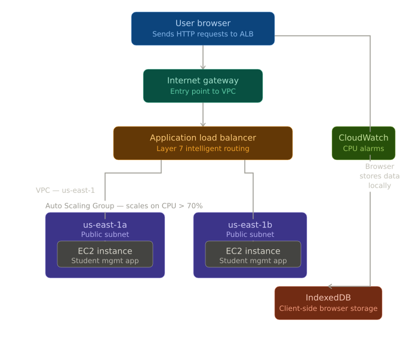
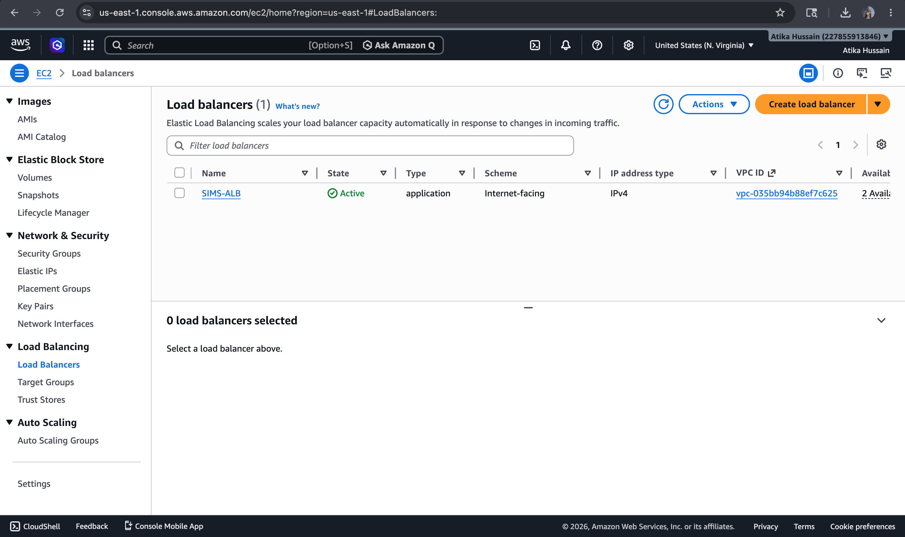
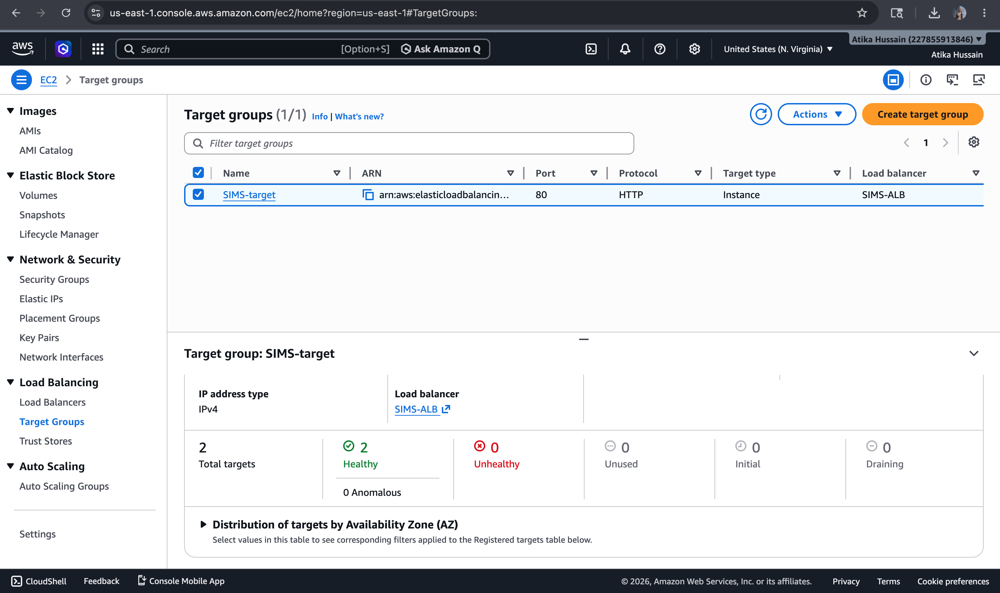
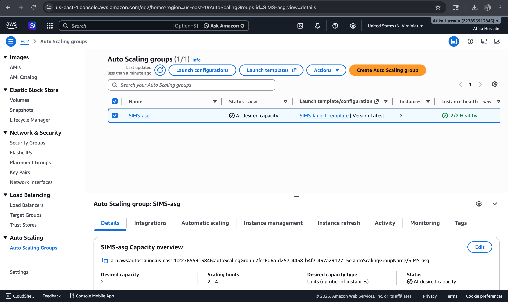
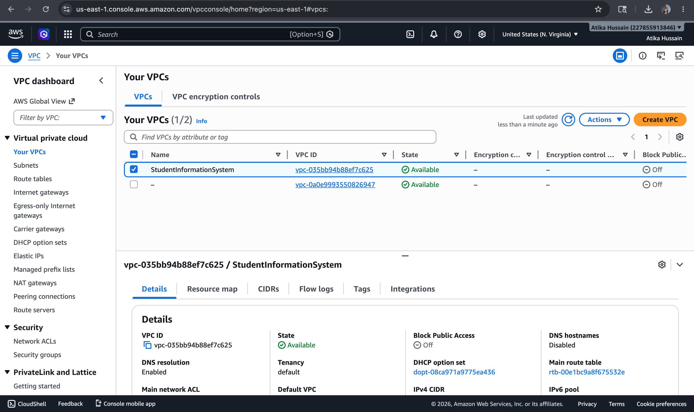
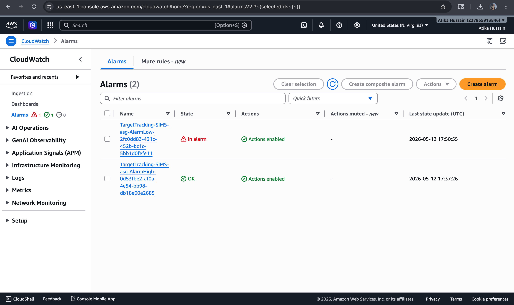

# HighAvail-StudentMS 
### Highly Available Student Management System deployed on AWS

A web-based Student Management System built with HTML, CSS, JavaScript, Bootstrap, and IndexedDB — deployed on AWS with a highly available and scalable architecture using EC2, Application Load Balancer, Auto Scaling Group, and VPC across multiple Availability Zones.

---

## 🌐 Live Architecture



---

## ☁️ AWS Architecture Overview

| Component | Service | Purpose |
|---|---|---|
| Compute | Amazon EC2 | Hosts the web application |
| Load Balancing | Application Load Balancer (ALB) | Layer 7 intelligent traffic routing |
| Scaling | Auto Scaling Group (ASG) | Automatically scales EC2 instances |
| Networking | VPC + Public Subnets | Isolated network across 2 AZs |
| Monitoring | Amazon CloudWatch | CPU alarms trigger auto scaling |
| Storage | IndexedDB | Client-side browser data storage |

---

## 🏗️ High Availability Design

- **Multi-AZ deployment** — EC2 instances deployed in `us-east-1a` and `us-east-1b`
- **Fault tolerant** — if one Availability Zone goes down, traffic automatically routes to the healthy AZ with zero downtime
- **Auto Scaling** — CloudWatch monitors CPU utilization; when it exceeds 70%, ASG automatically launches a new EC2 instance
- **Intelligent routing** — ALB distributes traffic across healthy instances using Layer 7 routing rules

---

## 🔄 Traffic Flow

```
User Browser
     ↓
Internet Gateway
     ↓
Application Load Balancer (Layer 7)
     ↓              ↓
EC2 (us-east-1a)   EC2 (us-east-1b)
     ↓
Response served back to browser
     ↓
IndexedDB (client-side storage)
```

---

## 💻 Tech Stack

**Frontend:**
- HTML5
- CSS3
- JavaScript 
- Bootstrap 5
- IndexedDB (client-side database)

**Cloud Infrastructure (AWS):**
- Amazon EC2
- Application Load Balancer
- Auto Scaling Group
- Amazon VPC
- Amazon CloudWatch

---

## ✨ Features

- Add, update, delete student records
- Search and filter students
- Data persisted in browser via IndexedDB
- Responsive UI with Bootstrap
- Highly available — zero downtime architecture

---

## 🚀 AWS Deployment Steps

### 1. VPC Setup
- Created a VPC with 2 public subnets across `us-east-1a` and `us-east-1b`
- Attached an Internet Gateway for public access

### 2. EC2 Launch
- Launched EC2 instances in both public subnets
- Installed and configured the web application on each instance

### 3. Application Load Balancer
- Created an ALB with a target group pointing to both EC2 instances
- Configured Layer 7 routing rules
- Health checks enabled on both targets

### 4. Auto Scaling Group
- Created an ASG with the EC2 launch template
- Set minimum: 1, desired: 2, maximum: 4 instances
- Linked to ALB target group

### 5. CloudWatch Alarms
- Created CPU utilization alarm at 70% threshold
- Alarm triggers ASG scale-out policy automatically

---

## 📸 AWS Console Screenshots

### ALB — Active and healthy


### Target Group — Both instances healthy


### Auto Scaling Group


### VPC — 2 public subnets across AZs


### CloudWatch Alarm


---

## 🎯 What I Learned

- Designing fault-tolerant architectures using multiple Availability Zones
- Configuring ALB for intelligent Layer 7 traffic distribution
- Setting up Auto Scaling policies based on CloudWatch CPU metrics
- VPC networking — subnets, internet gateways, routing tables
- Difference between scaling up (vertical) vs scaling out (horizontal)

---

## 👩‍💻 Author

**Atika Hussain**
MCA Student @ PES University, Bengaluru
[LinkedIn](https://www.linkedin.com/in/atika-hussain-08b54a31b) 
